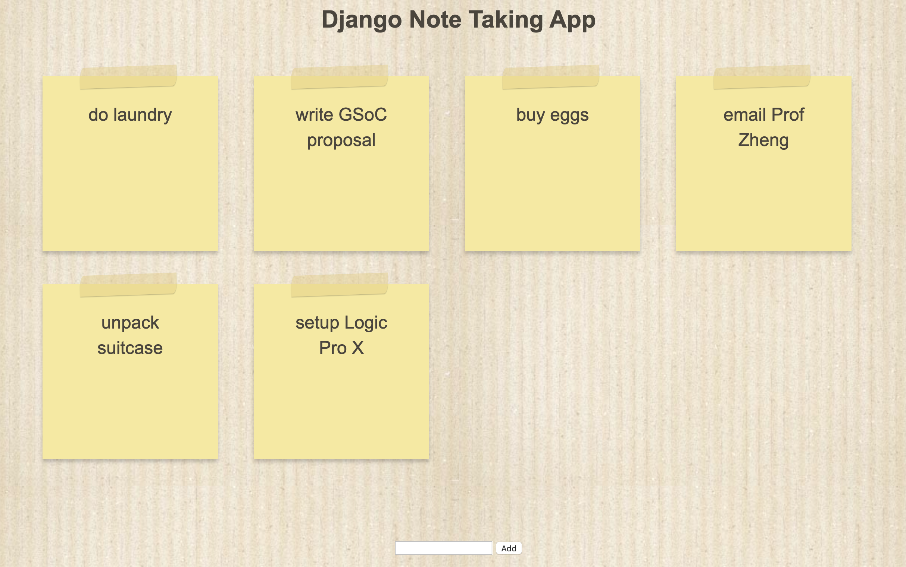
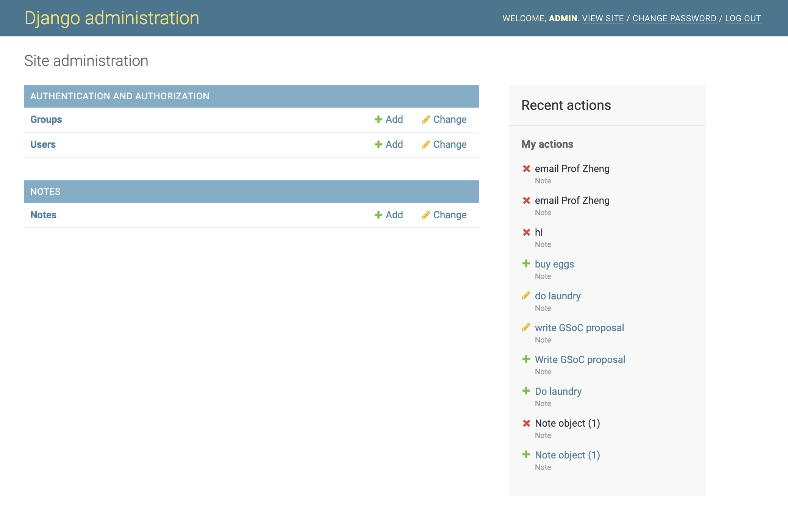
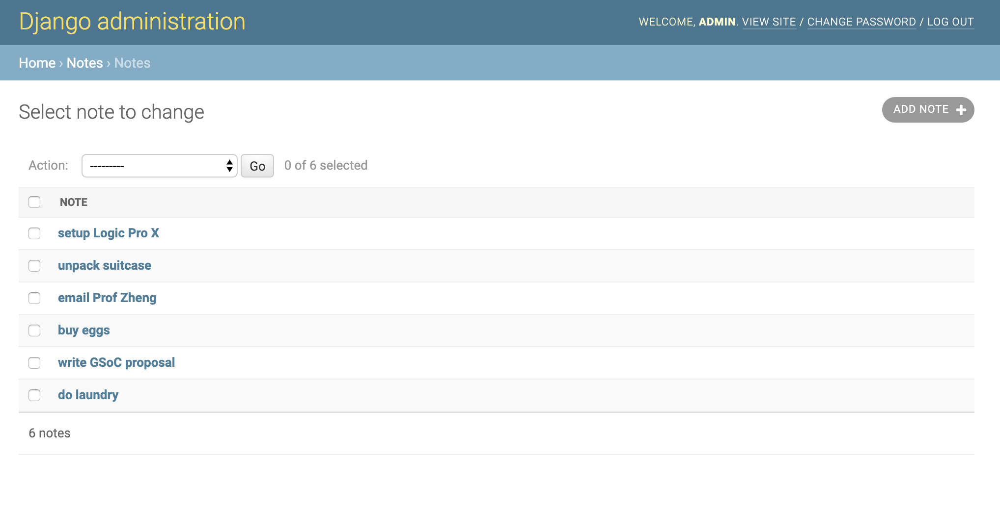

# Django Note Taking App

Django Note Taking App allows user to save notes and view them on a sticky-note-style dashboard.

See a live demo at: https://django-note-taking-app.herokuapp.com/notes/



The app also comes with an admin page to easily access and modify database.




## Getting Started


These instructions will get you a copy of the project up and running on your local machine for development and testing purposes. See deployment for notes on how to deploy the project on a live system.

### Prerequisites
* Python 3
* Django 3
* MySQL
* pymsql
* virtualenv

### Installing

* First, make sure you have all the dependencies listed above installed.

* Activate the virtual environment (at the base project directory)

```
source bin/activate
```

* Create the database`./mysite/`

```
python manage.py makemigrations
python manage.py migrate
```

* Start the server `./mysite/`

```
python manage.py runserver
```

* If the server is started successfully, you can now access the app at

```
http://127.0.0.1:8000/notes
```

and the admin page at

```
http://127.0.0.1:8000/admin
```

using a registered admin account:
```
username: admin

password: admin1234
```

or create a new admin account:

```
python manage.py createsuperuser
```

## Deployment

* Choosing a hosting provider
The hosting provider should support django projects. See a fairly exhaustive list at [Djangofriendly host](https://djangofriendly.com/index.html)

* Getting the project ready to publish

Read our SECRET_KEY and DEBUG variables from environment variables if they are defined, but otherwise use the default values in the configuration file.

./mysite/mysite/settings.py

```
# SECURITY WARNING: keep the secret key used in production secret!
# SECRET_KEY = 'cg#p$g+j9tax!#a3cup@1$8obt2_+&k3q+pmu)5%asj6yjpkag'
import os
SECRET_KEY = os.environ.get('DJANGO_SECRET_KEY', 'cg#p$g+j9tax!#a3cup@1$8obt2_+&k3q+pmu)5%asj6yjpkag')
```

```
# SECURITY WARNING: don't run with debug turned on in production!
# DEBUG = True
DEBUG = os.environ.get('DJANGO_DEBUG', '') != 'False'
```

Run the deployment checklist that django provides

```
python manage.py check --deploy
```

* Installing the project on a host (using Heroku as an example)

Create a `Procfile` in the project root directory and paste the following into the file
```
web: gunicorn mysite.wsgi --log-file -
```

Install `gunicorn`

```
pip3 install gunicorn
```

Install `dj-database-url`
```
pip3 install dj-database-url
```

Configure database using `dj-database-url` in `settings.py`
```
# Heroku: Update database configuration from $DATABASE_URL.

import dj_database_url
db_from_env = dj_database_url.config(conn_max_age=500)
DATABASES['default'].update(db_from_env)
```

Register a Heroku account and install Heroku cli.


Create Heroku project and deploy our project

```
heroku create django-note-taking-app

git push heroku master

heroku open
```

## Built With

* [Django 3](https://www.djangoproject.com/) - the web framework used
* [MySQL](https://www.mysql.com/) - to create the database

## Author

* **Tong Kong**


## License

* This project is licensed under the MIT License - see the [LICENSE.md](LICENSE.md) file for details

## Acknowledgments

* This app is made based on [Django Tutorial: make a note taking app](https://pythonspot.com/django-tutorial-building-a-note-taking-app/)
